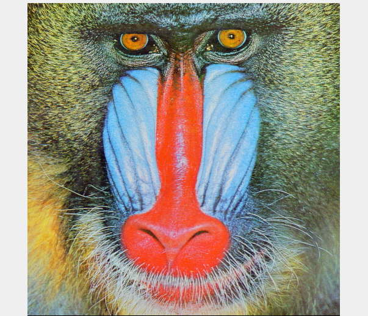
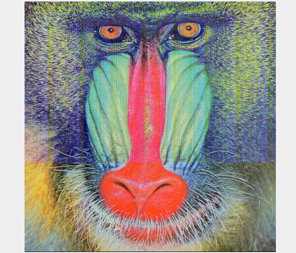
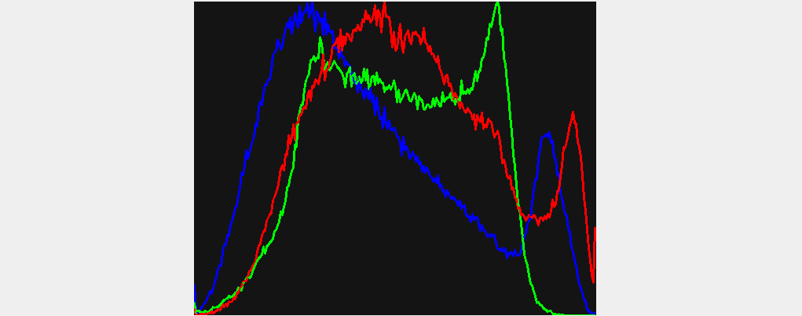
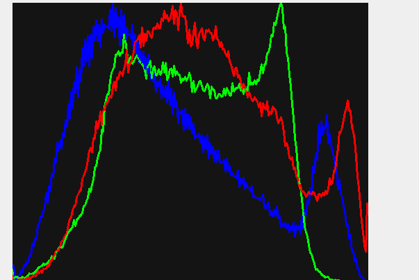
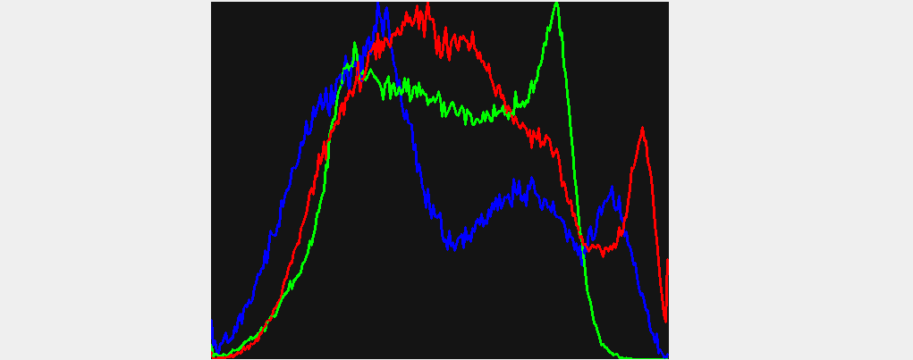

# Steganography with OpenCV

This educational project demonstrates data hiding in digital images using the OpenCV library.
The project is written in C++17 and explores LSB (Least Significant Bit) and MSB (Most Significant Bit) encoding techniques.

The main goal is to hide a payload (a Bash script) within the bits of a PNG image (strictly lossless), and then automatically extract and execute it.

---

## Technologies Used
**Language:** C++17
**Library:** OpenCV 4.x 
**Payload:** Bash Script 

---

## Project Architecture

The project is structured around a single source file that exposes five essential functionalities:

`encodeLSB()`: Encodes the bash script into the LSB bits of the blue (B) channel.A modification of $\pm1$ out of 255 is completely invisible to the human eye.The generated image is visually identical to the original.
`encodeMSB()`: Encodes the script into the MSB bits (weight 128).This function produces major visual distortions and is included exclusively to demonstrate the impact of modifying significant bits.
`showRichHistogram()`: Calculates and displays RGB histograms to compare the original image with the stego image.
`showLSBPlane()`: Extracts and visualizes the LSB bit plane.It allows observing the hidden data patterns compared to the natural noise of the original image.
`extractAndRun()`: Extracts the bash script from the stego image, saves it to disk (`extracted.sh`), and executes it using the `system()` call.

## Visual Comparison

**LSB (Least Significant Bit):** The modifications are visually imperceptible, making it ideal for real steganography.
**MSB (Most Significant Bit):** Produces major chromatic artifacts due to the modification of the $2^{7}=128$ weight bit, making it highly visible and immediately detectable.

---

## Security Notes and Limitations

**Execution Risk:** Using `system()` to directly execute a script extracted from an image represents a real attack vector.This project is purely demonstrative.In production systems, no image should be executed without rigorous validation.
**MSB Technique:** It is for EXCLUSIVELY EDUCATIONAL purposes.Any observer would immediately detect the altered image.
**JPEG Compression:** The PNG format is mandatory.Saving in lossy formats (such as JPEG) destroys the LSB data through recompression, eliminating any hidden payload.

---

## How to Run the Project
*(Fill in your specific compilation steps here, e.g.: `g++ main.cpp -o stego $(pkg-config --cflags --libs opencv4)`)*
